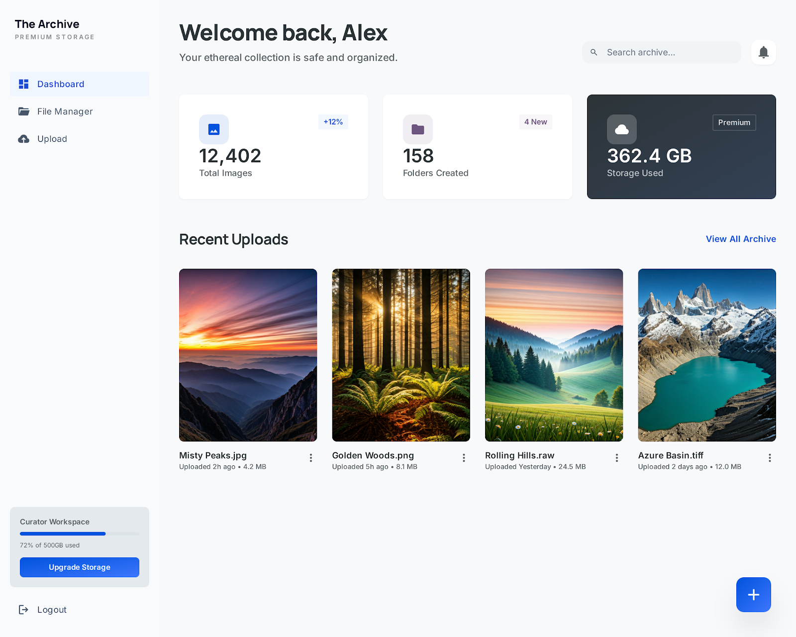

<p align="center">
  <h1 align="center">☁️ OneCloudSync</h1>
  <p align="center">
    <strong>Personal Cloud Infrastructure for Photo Sync</strong>
  </p>
  <p align="center">
    A self-hosted photo storage system powered by a React PWA and a Node.js home server.
  </p>
  <p align="center">
    
    
    
    
    
  </p>
</p>

---

## 🖥️ Dashboard Preview



---

## 🌟 Overview

OneCloudSync is a **personal cloud system** that lets you upload and store photos from your smartphone to your home server.

### Key Features

- 📤 **Photo Upload** — Single and batch upload with drag & drop
- 🖼️ **Gallery** — Browse and manage your photo collection
- 🔒 **Secure** — API key auth, rate limiting, optional VPN-only access (Tailscale)
- 💰 **Zero Cost** — Runs entirely on your own hardware

---

## 🛠️ Case Study: Zero-Cost Homelab Deployment

> 🚀 **Engineering Spotlight for Founders & Entrepreneurs**
>
> This project isn't just code—it's a fully operational production setup built on a **$0 infrastructure budget** by repurposing an old **2010 Toshiba Satellite L655 laptop** as a hardened home server. 
> 
> Key engineering highlights of this real-world deployment:
> - **Zero Open Ports**: Entirely isolated behind a secure **Tailscale VPN (WireGuard)**. No public exposure, no open router ports.
> - **Extreme Resource Optimization**: Configured to run PostgreSQL, Express, Nginx, and Tailscale smoothly on just **4.1 GB of RAM** by disabling the desktop environment and tuning database buffers.
> - **Zero Cost**: Repurposed hardware + free-tier developer tools.
>
> 📂 Curious about how it was done? Check out the [Personal Setup & Hardening Guide](./docs/my-setup/README.md).

---

## 🏗️ Architecture

```
📱 Phone / Browser (React PWA)
      │
      └──► Nginx ──► Express API
                       │
                  ┌────┴────┐
                  │         │
               Photos   PostgreSQL
             (Filesystem) (Metadata)
```

---

## 📁 Project Structure

```
OneCloudSync/
├── backend/              # Node.js + Express REST API
│   ├── src/
│   │   ├── server.js
│   │   ├── routes/
│   │   ├── controllers/
│   │   ├── models/
│   │   ├── middleware/
│   │   └── config/
│   ├── uploads/          # Photo storage (date-organized)
│   ├── package.json
│   └── .env
│
├── frontend/             # React PWA (Vite)
│   ├── public/
│   ├── src/
│   └── package.json
│
├── docs/                 # Full technical documentation
│   ├── 01-project-vision/
│   ├── 02-architecture/
│   ├── 03-infrastructure/
│   ├── 04-features/
│   ├── 05-deployment/
│   └── 06-roadmap/
│
└── README.md             ← You are here
```

---

## 📚 Documentation

Full technical documentation is available in the [`docs/`](./docs/README.md) directory:

| Section | What's Inside |
|---------|--------------|
| [Project Vision](./docs/01-project-vision/project-overview.md) | Goals, scope, design principles |
| [Architecture](./docs/02-architecture/system-architecture.md) | System topology, component design |
| [API Design](./docs/02-architecture/api-design.md) | All REST endpoints with schemas |
| [Server Specs](./docs/03-infrastructure/server-specs.md) | Hardware report, resource budgeting |
| [Tech Stack](./docs/03-infrastructure/tech-stack.md) | All technologies and why they were chosen |
| [Dev Setup](./docs/03-infrastructure/remote-ssh-setup.md) | VS Code Remote-SSH configuration |
| [Storage](./docs/04-features/hybrid-storage.md) | Filesystem + PostgreSQL hybrid approach |
| [Deployment](./docs/05-deployment/README.md) | Running with Docker Compose or manually, on any device |
| [Roadmap](./docs/06-roadmap/implementation-plan.md) | Phased implementation plan |
| [Personal Setup](./docs/my-setup/README.md) | Specs, Tailscale VPN hardening, & auto-run scripts |

---

## 🖥️ Requirements

| Component | Minimum |
|-----------|---------|
| **RAM** | 2 GB+ |
| **Storage** | 50 GB+ (depends on your photo collection) |
| **Runtime** | Docker + Docker Compose — or Node.js v20+ |
| **Database** | PostgreSQL (bundled when using Docker) |

---

## 🚀 Quick Start

### 🐳 Option A — Docker (recommended)

Runs PostgreSQL, the API, and the PWA in one command. Requires Docker + Docker Compose.

```bash
git clone <repo-url>
cd OneCloudSync

cp .env.example .env    # set a real DB_PASSWORD and API_KEY
docker compose up -d --build
docker compose run --rm backend node src/config/db-init.js   # first run only

# → open http://localhost:8080 and log in with your API_KEY
```

Photos are stored on the host in `./photos/`; database data lives in a Docker volume. See the [Deployment Guide](./docs/05-deployment/README.md) for backups and configuration.

### 🔧 Option B — Manual (local development)

```bash
# 1. Clone the repository
git clone <repo-url>
cd OneCloudSync

# 2. Set up the backend (requires a local PostgreSQL)
cd backend
cp .env.example .env    # Edit with your own values
npm install
npm run db:init
npm run dev

# 3. Set up the frontend
cd ../frontend
npm install
npm run dev             # proxies /api to localhost:3000
```

> See [backend/.env.example](./backend/.env.example) for all configuration options.
> Tip: you can also run just the database in Docker: `docker compose up -d db`

---

MIT License — see the [LICENSE](LICENSE) file for details.

---

> Built with ☕ by Sharif
