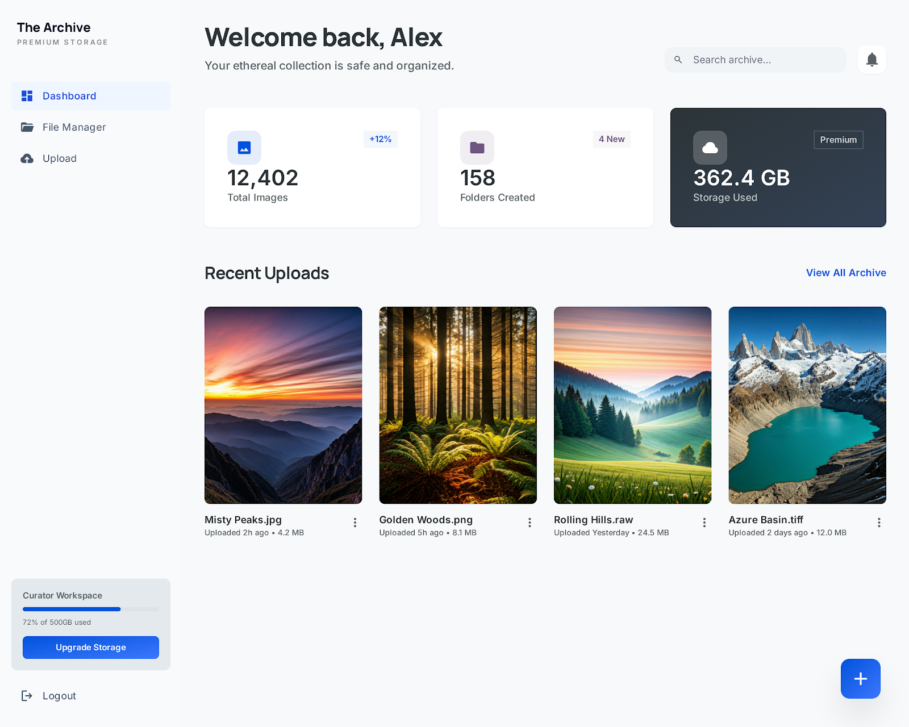

<p align="center">
  <h1 align="center">☁️ OneCloudSync</h1>
  <p align="center">
    <strong>Personal Cloud Infrastructure for Photo Sync</strong>
  </p>
  <p align="center">
    A self-hosted photo storage system powered by a React PWA and a Node.js home server.
  </p>
  <p align="center">
    
    
    
    
  </p>
</p>

---

## 🖥️ Dashboard Preview



---

## 🌟 What is this?

OneCloudSync lets you upload and store photos from your phone to your own server. No cloud subscriptions, no third-party storage — just your hardware.

- 📤 **Upload** — Single and batch upload with drag & drop
- 🖼️ **Gallery** — Browse and manage your photos
- 🔒 **Secure** — API key auth + optional Tailscale VPN
- 💰 **Free** — Runs on any machine you already own

---

## 🏗️ Architecture

```
📱 Phone / Browser (React PWA)
      │
      └──► Nginx ──► Express API
                       │
                  ┌────┴────┐
                  │         │
               Photos   PostgreSQL
            (filesystem) (metadata)
```

Photos are stored as **files on disk** (`./photos/YYYY/MM/DD/uuid.jpg`). Metadata (names, sizes, hashes) lives in **PostgreSQL**. This keeps backups simple — `rsync` the photos folder, `pg_dump` the database.

---

## 🚀 Quick Start

Requires **Docker** + **Docker Compose**.

```bash
git clone <repo-url>
cd OneCloudSync

cp .env.example .env          # set DB_PASSWORD and API_KEY
docker compose up -d --build
```

Open `http://localhost:8080` and log in with your `API_KEY`.

> **First run?** Initialize the database:
> ```bash
> docker compose run --rm backend node src/config/db-init.js
> ```

---

## 📁 Project Structure

```
OneCloudSync/
├── backend/           # Node.js + Express API
├── frontend/          # React PWA (Vite)
├── docker-compose.yml
├── .env.example
├── photos/            # Uploaded photos (host-mounted volume)
└── docs/
    └── my-setup.md    # Personal server notes
```

---

## 🔐 Tailscale (optional)

Want to access your photos **from anywhere** — not just your home WiFi? [Tailscale](https://tailscale.com) creates a private encrypted tunnel (WireGuard) between your devices. No port forwarding, no router config, free for personal use.

**1. Install on your server:**

```bash
curl -fsSL https://tailscale.com/install.sh | sh
sudo tailscale up
tailscale ip -4          # → gives you something like 100.103.154.10
```

**2. Install on your phone:** Download Tailscale from the App Store / Play Store, sign in with the same account. (make sure that tailscale is running on both devices)

**3. Lock down the app** — add one line to `.env`:

```dotenv
BIND_IP=100.103.154.10  # replace with your server's Tailscale IP from step 1 
```

Then `docker compose up -d`. Now the app is reachable **only** through Tailscale — invisible to your local network.

**4. Connect from anywhere:** Open `http://100.103.154.10:8080` on your phone. Works from home, from a café, from another country — as long as Tailscale is running on both devices.

---

## 🛠️ Development

```bash
# Run just the database in Docker
docker compose up -d db

# Backend
cd backend && npm install && npm run dev

# Frontend (in another terminal)
cd frontend && npm install && npm run dev
```

The Vite dev server proxies `/api` to `localhost:3000` automatically.

---

## 🔧 Real-World Deployment

This project runs 24/7 on a **2010 Toshiba Satellite L655** (4 GB RAM, 430 GB HDD) behind a Tailscale VPN — zero cost, zero open ports. See [my-setup.md](./docs/my-setup.md) for the full story.

---

MIT License — see the [LICENSE](LICENSE) file for details.

> Built with ☕ by Sharif
